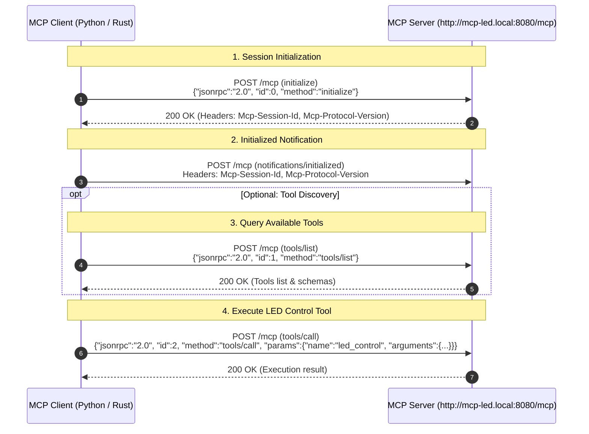

# MCP LED Control Clients

[](https://opensource.org/licenses/MIT)
[](https://modelcontextprotocol.io/)
[](python/README.md)
[](rust/README.md)

Multi-language client applications for controlling LED hardware and devices over HTTP using the **Model Context Protocol (MCP)** JSON-RPC 2.0 specification.

---

## 📁 Repository Overview

This repository contains client implementations in multiple programming languages to interact with an MCP-compatible LED server:

| Folder | Language | Dependencies | Description | README |
| --- | --- | --- | --- | --- |
| [`python/`](python/) | Python 3 | None (Standard Library) | Lightweight, portable CLI client | [Python Guide](python/README.md) |
| [`rust/`](rust/) | Rust | `reqwest`, `serde`, `serde_json` | High-performance, type-safe CLI client | [Rust Guide](rust/README.md) |

---

## ✨ Supported Features

Both client implementations support full LED control capability:

- 🔄 **Session Management**: Automated MCP initialization handshake (`initialize` -> `notifications/initialized`) with HTTP header tracking (`Mcp-Session-Id`, `Mcp-Protocol-Version`).
- 💡 **Basic Controls**: Turn LED `on`, `off`, or `toggle` power state.
- 🎨 **Preset Colors**: Quick color shortcuts for `red`, `green`, and `blue`.
- 🎛️ **Custom RGB & CSS Colors**: Pass precise RGB channel values (`0-255`) or CSS color strings.
- 🎯 **Target LED Indexing**: Specify target LED position via `--index` (`0-...`, or `256` for all LEDs).
- 🌈 **Animations**: Enable rainbow color cycles.
- 🔍 **Tool Discovery**: Query available server tools via `tools/list` (`list` action or `--list-tools`).

---

## 🔌 Protocol Sequence Diagram



---

## 🚀 Quick Start

### Python Client

Navigate to the `python/` directory and run:

```bash
# Basic action
python python/control_led.py toggle

# Preset color
python python/control_led.py red

# Rainbow animation
python python/control_led.py --rainbow
```

For full options and documentation, see [python/README.md](python/README.md).

### Rust Client

Navigate to the `rust/` directory and run:

```bash
# Run with Cargo
cd rust
cargo run -- toggle

# Set custom RGB
cargo run -- --r 255 --g 128 --b 0
```

For full options and documentation, see [rust/README.md](rust/README.md).

---

## 📄 License

Distributed under the MIT License. See [LICENSE](LICENSE) for details.
