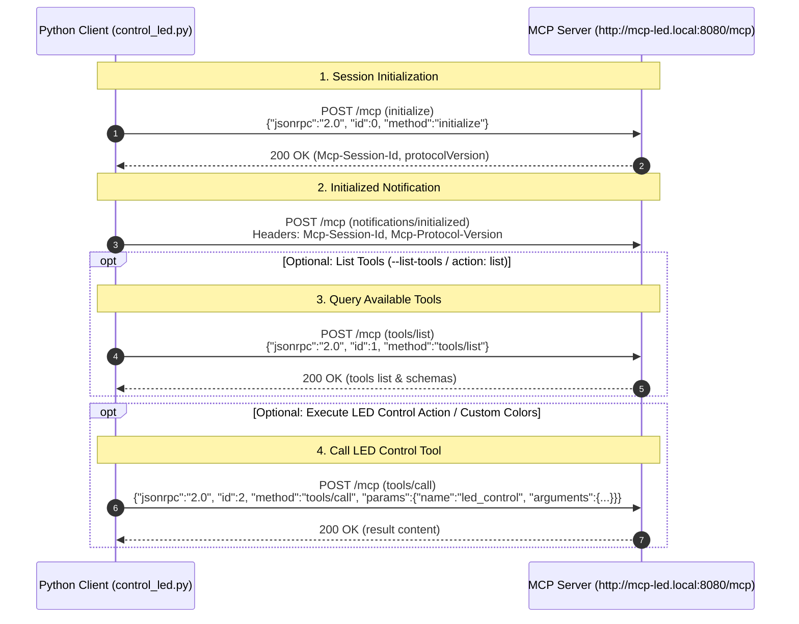

# LED Control Client (MCP)

[](https://opensource.org/licenses/MIT)
[](https://modelcontextprotocol.io/)

Python script to control an LED device using the **Model Context Protocol (MCP)** over HTTP/JSON-RPC.

## Features

- Communicates with MCP server over HTTP JSON-RPC 2.0.
- Supports turning the LED **on** / **off**, **toggling** state, and setting preset colors (**red**, **green**, **blue**).
- Supports custom RGB channels (`--r`, `--g`, `--b`), CSS color strings (`--color`), rainbow effect (`--rainbow`), and LED index selection (`--index`).
- Supports querying available tools via `tools/list` using the `list` action or `--list-tools` (`-l`, `--list`) flag.
- Supports positional arguments or explicit `--mdns` and `--port` connection flags.
- Uses Python standard libraries (`urllib`, `json`, `argparse`) with no extra dependencies needed.

## Command Syntax

```bash
python control_led.py [action] [mdns] [port] [options]
```

### Arguments & Flags

| Argument / Flag | Required | Default | Description |
| --- | --- | --- | --- |
| `[action]` / `--action` | No* | — | LED action: `on`, `off`, `toggle`, `red`, `green`, `blue`, `list` (*Required if `--list-tools`, RGB, color, rainbow, or index options are not passed) |
| `[mdns]` / `--mdns` | No | `mcp-led` | Hostname prefix for target device (`http://{mdns}.local:{port}/mcp`) |
| `[port]` / `--port` | No | `8080` | Target server HTTP port |
| `--list-tools` / `-l` / `--list` | No | `false` | Optional flag to fetch and display available tools from the server via `tools/list` |
| `--r` | No | — | Red channel intensity (`0-255`) |
| `--g` | No | — | Green channel intensity (`0-255`) |
| `--b` | No | — | Blue channel intensity (`0-255`) |
| `--color` | No | — | Color string (e.g., `'rgb(255,0,0)'`) |
| `--rainbow` | No | `false` | Enable rainbow animation effect |
| `--index` | No | — | LED position (`0-...`) or `256` for all |

---

## Connection Sequence Diagram



---

## Usage Examples

### Listing Available Tools (`tools/list`)

```bash
# List tools using the 'list' action
python control_led.py list

# List tools using the optional flag
python control_led.py --list-tools

# List tools on a custom server
python control_led.py --list-tools my-custom-led 9090
```

### Standard Commands (Default Host: `http://mcp-led.local:8080/mcp`)

```bash
# Turn LED ON / OFF / Toggle
python control_led.py on
python control_led.py off
python control_led.py toggle

# Set LED color to Red, Green, or Blue
python control_led.py red
python control_led.py green
python control_led.py blue
```

### Advanced Color & Animation Controls

```bash
# Custom RGB values
python control_led.py --r 255 --g 128 --b 0

# Custom CSS Color String
python control_led.py --color "rgb(255,0,0)"

# Enable Rainbow Effect
python control_led.py --rainbow

# Target Specific LED Index (e.g., LED position 0, or 256 for all)
python control_led.py --r 255 --g 0 --b 0 --index 0
python control_led.py toggle --index 256
```

### Custom Server Hostname & Port

```bash
# Custom mDNS hostname (connects to http://my-custom-led.local:8080/mcp)
python control_led.py toggle my-custom-led

# Custom mDNS hostname and port via positional arguments
python control_led.py toggle my-custom-led 9090

# Custom server via explicit connection flags
python control_led.py --rainbow --mdns my-custom-led --port 9090
```